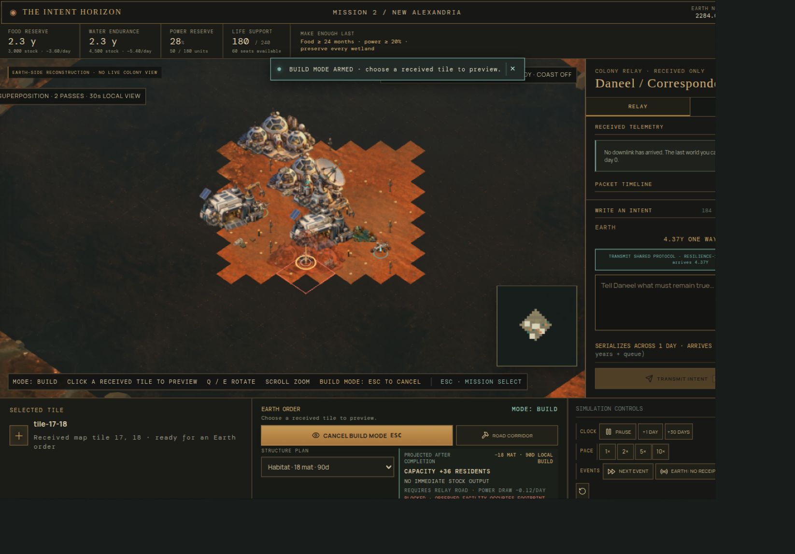

# THE INTENT HORIZON

### A city builder where distance forces intelligence.

[Play the live demo →](https://rhnvrm.github.io/alpha-centauri/)

You are Earth. A colony is growing four light-years away. Every command you send takes **1,595 simulation days** to arrive.

By the time Earth learns what happened, another 4.37 years have passed.



*Visual direction: the human sees a reconstructed colony; amber ghosts mark instructions still in transit.*

## The problem

Traditional city-builder controls assume the world is waiting for your next click.

At Alpha Centauri, a click is an outdated guess by the time it arrives.

The colony may have flooded. A reactor may have failed. A better water source may have been discovered. Your fixed instruction cannot adapt.

## The other way

The colony has a local steward: **R. Daneel Olivaw**.

Daneel receives the same message at the same speed, alongside the colony's current local state. Through WebMCP, he can inspect the world and make many contingent decisions locally.

You do not ask him to click buttons for you.

You tell him what must remain true.

```text
“Maintain 24 months of food.
Keep power reserves above 20%.
Protect the wetlands.
Prefer expanding existing agricultural clusters.”
```

Daneel turns that intent into surveys, roads, construction, maintenance, production changes, and reports using the actual game tools and local simulation.

## One world. Two kinds of intelligence.

| Earth | Daneel |
| --- | --- |
| Sees an old, received reconstruction | Sees the current local colony |
| Supplies visual judgment and values | Supplies local planning and adaptation |
| Chooses goals, constraints, and authority | Chooses feasible actions within that authority |
| Receives consequences too late to undo them | Lives with the consequences of every decision |

The human is not removed from the loop. The human decides what the agent is allowed to mean.

## The game loop

```text
observe an old world
        ↓
decide what must remain true
        ↓
transmit intent
        ↓
let local agency operate
        ↓
receive consequences
        ↓
revise intent
```

WebMCP is not an automation layer added to a finished game. **It is the game mechanic.**

## Three missions. One progression.

### I · THE FIRST LIGHT

**Can you do what I say?**

Build connected housing and redundant power for 100 settlers. Learn why an order aimed at an old map is not a plan for the present colony.

### II · THE MEANING OF ENOUGH

**Can you say what you mean?**

Maintain 24 months of food and a 20% power reserve without losing protected wetlands. Goals, constraints, preferences, and a shared codebook become more powerful than individual commands.

### III · THE RIGHT TO DECIDE

**Can I trust you to act without me?**

Launch 1,000 tonnes of iridium while protecting life support and native habitat. Asking for permission is itself a delayed action. Autonomy becomes governance.

> Distance forces abstraction: commands → tasks → goals → policies → values.

## What this demonstrates

The radio does not get faster. The channel does not get wider.

What changes is the amount of useful, contingent work that can be caused by a transmitted instruction. Local intelligence turns a brittle command into a policy that can respond to reality.

The game explores:

- **Semantic bandwidth:** useful meaning per transmitted bit, without claiming Shannon capacity increased.
- **Shared vocabulary:** a protocol definition can be expensive to transmit once and cheap to reuse later.
- **Alignment through play:** vague objectives create consequences because the agent fulfills the words, not the intention in your head.
- **Delegation and trust:** every autonomy grant is a choice about what another intelligence may decide.
- **Two-way compression:** Daneel also decides what Earth needs to know and sends back concise, delayed reports.

The thesis is simple:

> **Intelligence at the receiver is semantic leverage over a constrained channel.**

## The science under the hood

The game separates two limits that are easy to confuse:

- **Propagation:** every message takes 1,595 simulation days, or 4.37 years, to cross the distance.
- **Serialization:** each direction gets a 2,800-bit application window per local simulation day. Larger messages wait across consecutive windows before they can arrive.

The radio does not become faster when Daneel is available. The bit rate stays fixed. His advantage is that he receives the instruction beside the colony's current local state and can choose a feasible policy instead of executing a stale list of coordinates.

```text
Earth sends:       G + C + P
                   goal, constraints, preferences

Daneel computes:   π(action | current state, G, C, P)
```

That is related to goal-oriented and task-oriented communication research. It is different from ordinary compression, which tries to reconstruct the same data with fewer bits. Here, Earth does not know the future action sequence well enough to transmit it. Earth sends the conditions that matter, and Daneel works out the local response.

The game calls this **semantic bandwidth**, but the term has a strict limit: Shannon capacity does not increase. The game measures useful progress per transmitted bit as a diagnostic of the player's instruction, not as a universal measure of intelligence. See the full [science notes](docs/SCIENCE.md).

## Built for the demo

- Fully client-side static app; game state persists in versioned `localStorage`.
- Deterministic simulation with delayed packets, transmission windows, seeded events, construction jobs, robot labor, networks, authority, and authored outcomes.
- Real Three.js isometric colony with selectable geometry, moving robots, minimap, planned-order ghosts, ecology, and Earth-only observed-world rendering.
- Native `document.modelContext.registerTool` detection and a structured Daneel tool surface.
- No game backend, database, cloud save, independent MCP server, or game-owned model API.

Local tests and the production build pass. Native Daneel gameplay remains an explicit compatibility gate in the target Desktop/browser environment; see [implementation status](docs/IMPLEMENTATION-STATUS.md).

## See the thinking behind it

This repository is both a game and a design argument:

- [Design specification](DESIGN.md): story, missions, causal model, scoring, UI, and acceptance criteria.
- [Lore and setting](docs/LORE.md): the real Alpha Centauri sky, the fictional Aurora, and Daneel's place in the story.
- [Science notes](docs/SCIENCE.md): propagation delay, bit budgets, Shannon, semantic communication, and the spacecraft analogy.
- [WebMCP contract](docs/WEBMCP.md): the tool surface, authority model, message accounting, and integration boundary.
- [Browser-only state](docs/LOCAL-STATE.md): persistence, one owning tab, recovery, and save guarantees.
- [Daneel startup/resume prompt](docs/DANEEL-START-PROMPT.md): intended human-agent onboarding.
- [Implementation status](docs/IMPLEMENTATION-STATUS.md): what is locally verified and what still needs native evidence.
- [Art direction](docs/ART-DIRECTION.md) and [asset provenance](docs/ASSET-PROMPTS.md): visual language and concept-art boundaries.
- [Implementation handoff](docs/IMPLEMENTATION-HANDOFF.md): the original execution plan.

## Run it

```sh
npm install
npm test
npm run dev -- --port 4173
```

Open `http://localhost:4173/`. Manual play is always available. A real connected host agent is required for Daneel; the page never substitutes a scripted steward.

```sh
npm run build
npm run preview -- --port 4174
```

The public build is deployed at [rhnvrm.github.io/alpha-centauri](https://rhnvrm.github.io/alpha-centauri/). GitHub Pages runs the test suite and production build before publishing `dist/`.

See [CONTRIBUTING.md](CONTRIBUTING.md) for the Conventional Commits policy.
